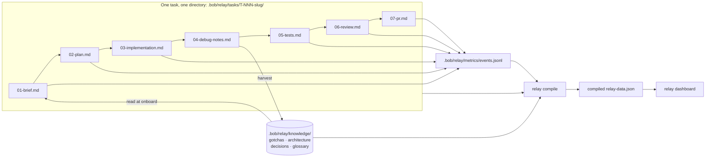

# Architecture

Relay is two layers around one shared data contract (`cli/src/types.ts`).

## Layers

**1. Bob IDE configuration (`.bob/relay/`)**
Custom modes, rules, and skills that make Bob read `.bob/relay/knowledge/` at the
start of a task and write a structured stage artifact at the end of one.
Bob is the only thing that writes prose into `.bob/relay/tasks/*/`; it never
writes the JSON directly - `task.json` is kept in sync by the CLI as stages
complete.

**2. CLI (`cli/`)**

- `scaffold` - creates a new `.bob/relay/tasks/T-NNN-<slug>/` directory with an
  initial `task.json` and empty stage files.
- `events` - append-only writer/reader for `.bob/relay/metrics/events.jsonl`.
- `compile` - reads all of `.bob/relay/`, computes `ImpactSummary`, and writes
  the compiled dashboard data file (`config.yml`'s `dashboardData` path).
- `report` - terminal summary of relay-vs-baseline impact.
- `dashboard` - a static React app, pre-built and bundled in the package
  (`cli/dashboard-dist/`), served by `relay dashboard`. It only ever reads
  the single compiled data file - no server-side logic, no live queries -
  regenerate the file, refresh the page.

## The baton flow

The loop that matters is `D -- harvest --> K -- read at onboard --> A` for
the **next** task: every debug session makes the next task's onboarding
faster. That's the flywheel.
