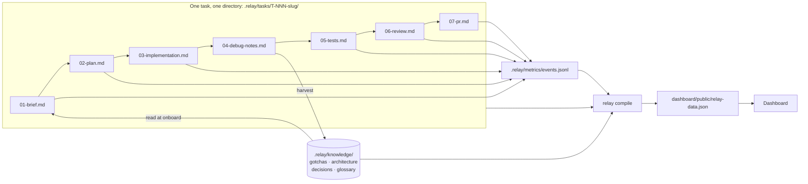

# Architecture

Relay is three layers around one shared data contract
(`cli/src/types.ts`, re-exported by `dashboard/src/lib/types.ts`).

## Layers

**1. Bob IDE configuration (`.bob/`)**
Custom modes, rules, and skills that make Bob read `.relay/knowledge/` at the
start of a task and write a structured stage artifact at the end of one.
Bob is the only thing that writes prose into `.relay/tasks/*/`; it never
writes the JSON directly - `task.json` is kept in sync by the CLI as stages
complete.

**2. CLI (`cli/`)**

- `scaffold` - creates a new `.relay/tasks/T-NNN-<slug>/` directory with an
  initial `task.json` and empty stage files.
- `events` - append-only writer/reader for `.relay/metrics/events.jsonl`.
- `compile` - reads all of `.relay/`, computes `ImpactSummary`, and writes
  `dashboard/public/relay-data.json`.
- `report` - terminal summary of relay-vs-baseline impact.

**3. Dashboard (`dashboard/`)**
A static React app that reads the single compiled `relay-data.json` file.
No server, no live queries - regenerate the file, refresh the page.

## The baton flow

The loop that matters is `D -- harvest --> K -- read at onboard --> A` for
the **next** task: every debug session makes the next task's onboarding
faster. That's the flywheel.
